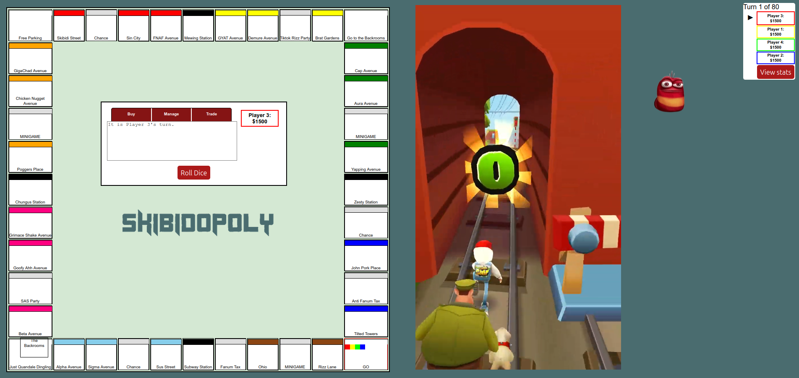

# SKIBIDOPOLY

> A modern twist on Monopoly designed to captivate Generation Alpha, developed during the Glasgow University Tech Society’s “Do You Have The GUTS” Hackathon, and proud **Winner of the SAS Challenge**.

## Setup & Run the Game

```
git clone https://github.com/aamukta-d/sas-monopoly-team32.git
cd sas-monopoly-team32
pip install -r requirements.txt
python app.py
```

Once the server is running, open your web browser and navigate to http://127.0.0.1:5000/ to start playing Skibidopoly!

